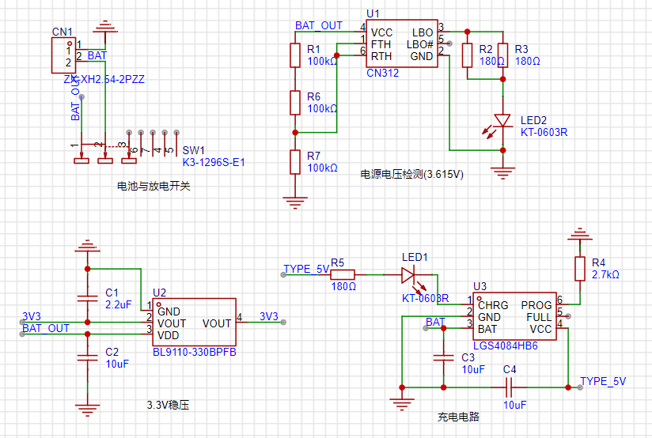
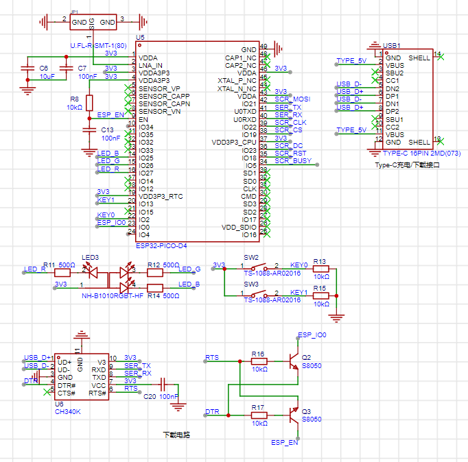
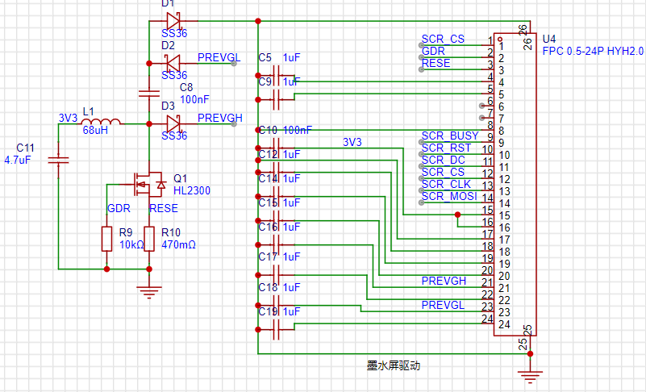
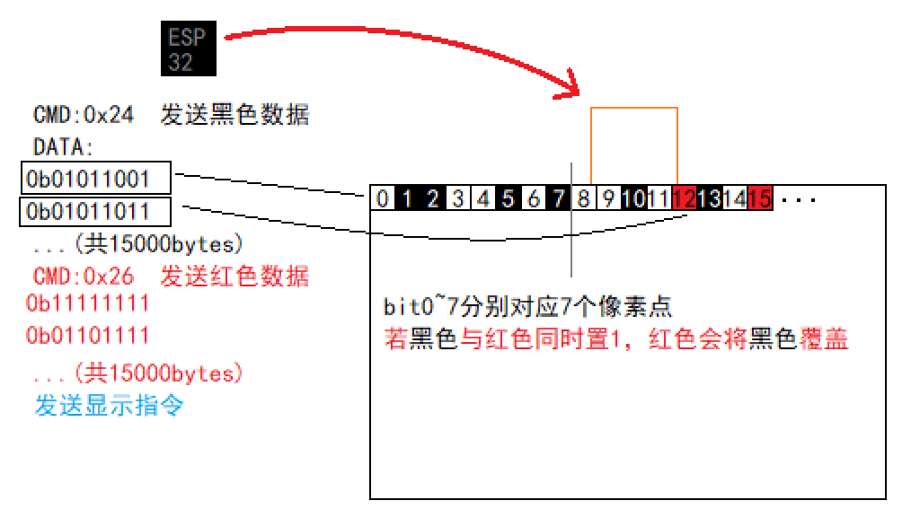
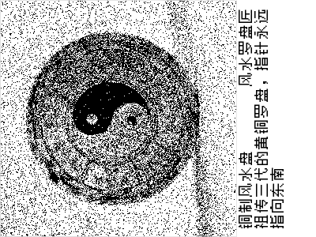

# 百工谱——AIGC物品展示框
## Artisan's Tome

[toc]

## 项目简介
一款基于ESP32的智能桌面艺术装置。

## 项目功能
本设备主控为ESP32 Pico-D4，基于预设库中时代、地域、职业等元素与文化符号，通过Kolors图像生成模型，创造出一件符合该时代与人物特征、独一无二的虚拟物品，通过墨水屏向用户展示，让每一次交互都成为在历史长河中的一次随机考古发掘。

## 开源链接
todo

## 视频链接
todo

## 使用说明
todo

## 结构设计
todo

## 硬件设计
### 电源电路

本设备采用3.7V锂电池供电，经线性稳压器BL9110-330BPFB输出3.3V，参考前作$^{[1]}$。
电源电压检测采用CN312，其内部主要包括电压比较器与基准电压源。简而言之，RTH引脚电压高于内部基准电压（1.205V）时LBO输出低电平，FTH低于基准电压时LBO输出高电平，LBO#引脚电平相反。方便起见，设置基准电压为3.605V，且FTH与RTH电压相等，则电源电压低于3.605V时LED亮起，反之熄灭。

### 主控电路

整体设计参考前作$^{[1]}$，其中由于按钮需要实现深度休眠唤醒功能，因此按钮连接在RTC GPIO（0, 2, 4, 5, 12, 13, 14, 15, 25, 26, 27, 32, 33, 34, 35, 36, 37, 38, 39）上，且需注意对应芯片内部自带的上下拉电阻。
与墨水屏连接（前缀SCR）的引脚建议改为SCK-18, MOSI-23, MISO-19, CS-5（对应硬件SPI），或顺序反向便于走线。

### 墨水屏驱动

按照$^{[2-3]}$进行设计，其中NMOS、肖特基二极管可自行替换。

## 嵌入式软件
### 网络连接、存储与配网
本项目支持WiFi连接与配网。
ESP32提供的Preferences库利用芯片内置的NVS，实现了数据的断电保留，可用于记录连接过的WiFi信息，实现自动连接。
设备每次成功连接后，记录WiFi的SSID与密码，在下次启动时将依次尝试连接所有记录的网络，直到成功或连接超时。
配网模式下，设备工作在AP模式，并维护一个HTTP服务器（页面使用html编写，储存在char*变量中）。用户连接ESP32的WiFi后，通过浏览器访问设置的固定地址```192.168.4.1:3000```，即可进入配网页面。用户输入WiFi的SSID与密码后，点击提交按钮，设备将尝试连接该WiFi，若成功则自动重启，并保存输入的表单内容。

### 休眠与唤醒
为保证设备在常开情况下能够长时间工作，在不需要生成图像时ESP32处于深度休眠状态，此时除RTC、ULP协处理器等外设几乎全部关闭，电流可降低到uA级别$^{[4]}$。
休眠后，可通过RTC GPIO唤醒，或通过RTC定时器唤醒，本项目中两方式均采用。
具体地，```esp_sleep_enable_timer_wakeup(us)```可配置设备在指定时间后自动唤醒，而```esp_sleep_enable_ext1_wakeup(pins, mode)```用于指定GPIO唤醒的引脚与模式（电平或边沿等），并在```esp_deep_sleep_start()```执行后进入休眠状态。
唤醒后```esp_sleep_get_wakeup_cause()```可获取唤醒原因，用于执行不同的操作。

### 网页访问
此部分参考$^{[1]}$即可。

### 墨水屏显示
项目采用汉硕WFH0420CZ35墨水屏，驱动程序可完全参考WaveShare 4.2inch e-Paper Module (B)$^{[5]}$，使用SPI接口进行通信，本项目使用GPIO模拟SPI时序。
本项目屏幕尺寸为400\*300，若仅使用黑色显示，则图片所需字节为400\*300/8=15000，在ESP32 Pico-D4中具有足够内存空间。
显示逻辑如下：
墨水屏为红黑白三色，因此需要将图片分为黑色、红色两部分。以黑色为例，每一位分别控制一个像素点（低电平为墨水显示），黑色会被红色覆盖。从左上角开始，15000字节依次对应从上到下、从左到右的像素点，低位在左。完成数据发送后，需向墨水屏发送全局刷新指令，更新图像。

若换用其他型号墨水屏，驱动程序需自行修改，但接口与代码框架大体类似。

## 图像生成与处理
### 运行平台与环境
图像生成与处理均在华为云FunctionGraph上运行$^{[1]}$。由于华为云的免费APIG服务已停止，但先前申请的APIG仍可使用，因此所有设备均调用已部署的API，传入用户自行配置的AI Token。
也可自己搭建服务器或使用类似服务，此时需要修改ESP32中的URL。

### Prompt设计
使用DeepSeek大语言模型的目的是，生成一段可用于生图的Prompt。由于完全使用AI生成会使得内容趋于同质化，因此部分可列举的元素使用随机生成。
为使AI生成的图像模型符合以下特征，Prompt采用“循序渐进”的方式，先根据职业生成人物设定，再根据设定生成物品，最后根据生成生图Prompt与物品描述，且严格限制输出格式以便读取。

```
"你是一位游戏中的平民阶层角色，年龄" + age + "，背景为" + culture + + "文化，" + era + '''时代。
请根据以下约束生成内容：
role：你的具体职业（具体而简短），该职业类型属于''' + role + '''
item：''' + typ + '''（8字以内，不要带括号），
该场景下参考物品品质：草帽5/酒30/铁锄50/米10/绢200/牛1500，该物品品质为''' + price + '''

description：一段简短的物品描述，25字以内，语言风格同样符合以上时代
prompt：用于文生图的提示词
- 必须包含：3D建模参考图，白色背景，等距视角，写实风格，物品材质+形态+颜色+细节特征，无拼接无透视变形
- 禁止出现：拼接碎片、透视变形
- 需描述物品形态/材质/颜色/典型特征

严格按照以下示例输出json：
{
"role":string
"item": string
"prompt"：string
"description": string
}
```

其中，随机元素已在代码中列举，用户可进行添加或修改：
```
age = str(np.random.randint(12, 70))
role = np.random.choice([
"农业/种植类", "工匠/工业/技术类", "养殖/畜牧类", "公共事务/法律类", "军事/安保类", 
"销售/贸易类", "文化/教育类", "宗教/术士/哲学类", "医疗/护理/卫生类", "艺术/表演/创作类", 
"交通/运输/物流类", "采集/狩猎/渔业类", "能源/矿产类", "服务业类",
"科技/研发类", "手工业/纺织类", "建筑/园林类", "食品/餐饮类", "天文/地理类", "摊贩/店铺类"
])
if(np.random.random() < 0.8):
    era = np.random.choice(["西周", "汉代", "唐代", "明代", "民国", 
                            "1960年", "2000年", "2025年", "2277年"])
else:
    era = np.random.choice(["史前", "魔法时代", "水底世界", "末世"])
culture = np.random.choice(["江南", "岭南", "巴蜀", "中原", "西北", "东北", "西域",
                            "燕京", "滇南", "徽州", "荆楚", "齐鲁", "关中", "青藏", 
                            "草原", "海滨", "海岛", "客家", "闽南", "吴越", "壮乡"])
price = str(int(10 ** (np.random.random() * 4)))
if(np.random.random() < 0.5):
    typ = "生成一项与你的职业特征强相关的工具或物品。"
else:
    typ = "生成一项与你的职业弱相关或无关，但你可能会携带或使用的日常生活用品或个人配饰。"

```
返回示例如下：
```
{
    'role': '风水罗盘匠', 
    'item': '铜制风水盘', 
    'prompt': '3D建模参考图，白色背景，等距视角，写实风格，铜制圆盘
    表面氧化泛青，中央太极阴阳鱼浮雕，外圈镌刻天干地支篆文，边缘有磨
    损包浆', 
    'description': '祖传三代的黄铜罗盘，指针永远指向东南'}
```
Propmt用于图像生成，且传入以下参考图像以统一风格：


### 图像处理
为使彩色图像在黑白屏幕显示，需要将图像转为灰度图，并将尺寸缩小到300\*300（原图为1:1）。此后对图片进行随机抖动处理：
设像素点的灰度值为$g\in[0,1]$，则转换后灰度值为$h=g>rand()\hspace{2px}?\hspace{2px}1\hspace{2px}:\hspace{2px}0$，其中$rand()$服从$[0,1]$上的均匀分布。
完成后，在图像上添加文字，包括物品名称、拥有者职业与物品描述，字体采用Zpix。完整图像将进行旋转以适应屏幕方向，转换为15000字节的文件，对应墨水屏驱动时依次传递的120000像素（仅黑色）。
示例如下：

文件上传至阿里云对象存储（OS）指定路径中，云端向下位机发送生成成功信息后，下位机直接从OS下载图片。

## BOM表与费用

## 参考资料
[1] ljh345. 【星火计划】骑行导航辅助显示［EB/OL］. OSHWHub，2024-08，https://oshwhub.com/ljh345/cycling_assistance.
[2] YoToo DIY. 墨水屏驱动板 有示例［EB/OL］. Taobao，https://e.tb.cn/h.SVfh0rEaqfkrB5y?tk=m9hz4DtTtNR.
[3] Waveshare. 4.2inch e-Paper Module (B) Manual［EB/OL］. Waveshare WIKI，https://www.waveshare.net/w/upload/9/97/4.2inch_e-Paper_Schematic.pdf.
[4]Espressif. Arduino-ESP32深度睡眠模式：超低功耗设计与唤醒策略［EB/OL］. CSDN，2025-09，https://blog.csdn.net/gitblog_00419/article/details/151563516.
[5]reiyawea. [other] 两款汉朔4.2寸墨水屏电子价签拆解与点亮，型号都是Stellar-XL ［EB/OL］. MyDigit，2021-09，https://www.mydigit.cn/forum.php?mod=viewthread&tid=274369&page=1&authorid=1055519.